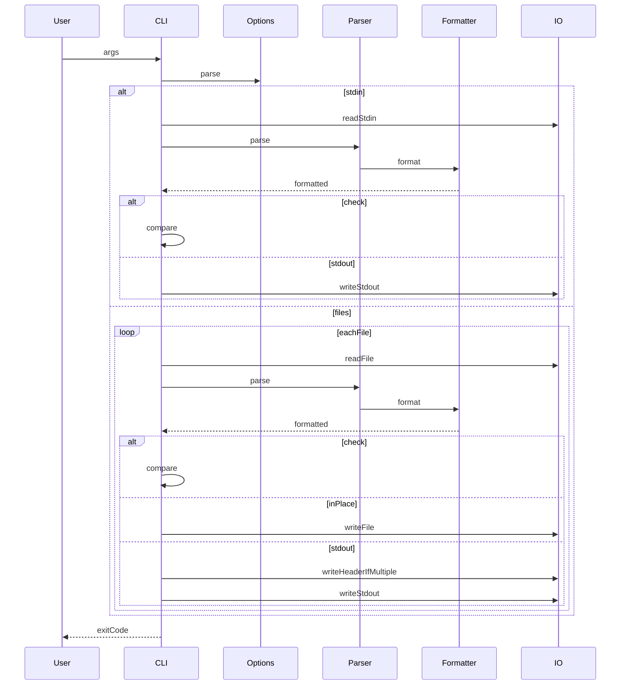

# 設計ドキュメント

## Overview
本機能は、Lean 4 向けフォーマッタ leanfmt の CLI 実装を完結させ、ファイル/標準入力の受け取り、出力モードの切り替え、決定的な整形結果、明確な失敗診断を提供する。Lean のネイティブパーサを基盤にして AST を生成し、AST から整形結果を生成するパイプラインで一貫性を担保する。

対象ユーザーは Lean 開発者および CI 管理者であり、ローカル整形・差分確認・CI チェックを同一 CLI で実行することを想定する。CLI と中核ロジックの境界を明確にし、入力/出力の IO 失敗を確実に診断することで、運用時の判断を容易にする。

### Goals
- ファイル入力と標準入力の両方をサポートし、CLI 入口で統一的に扱う
- stdout / in-place / check の 3 モードを排他的に切り替えられる
- check モードは stdin を許可し、ファイル未指定時は stdin がある場合に判定できる
- 標準 Lean 4 構文を少なくともサポートする
- stdout で複数ファイルを整形する場合はファイル名ヘッダを付与する（単一ファイル/ stdin は除外）
- 決定的かつ冪等な整形結果を保証し、CI 判定を安定化する
- 失敗原因を明確なメッセージと終了コードで返す

### Non-Goals
- ユーザーが自由に整形ルールを変更できる設定機構
- Lean 4 標準構文を超える方言・拡張の完全網羅
- IDE 連携や LSP レベルの増分フォーマット

## Requirements Traceability
| Requirement | Summary | Components | Interfaces | Flows |
|-------------|---------|------------|------------|-------|
| 1.1 | ファイルパス指定時に入力を読み込む | CLI Runner | CLI Service | CLI フロー |
| 1.2 | 標準入力を読み込む | CLI Runner | CLI Service | CLI フロー |
| 1.3 | 入力読取失敗を診断する | CLI Runner | CLI Service | エラー処理フロー |
| 2.1 | 標準出力モードで出力する | CLI Runner | CLI Service | CLI フロー |
| 2.2 | in-place で上書きする | CLI Runner | CLI Service | CLI フロー |
| 2.3 | check モードで一致判定する | CLI Runner | CLI Service | CLI フロー |
| 2.4 | モード競合をエラーにする | Options Parser | Options Service | オプション検証フロー |
| 3.1 | 決定的な整形結果を出す | Formatter Engine | Formatter Service | 整形フロー |
| 3.2 | 再整形で同一出力 | Formatter Engine | Formatter Service | 整形フロー |
| 3.3 | 構文的に有効な出力を生成 | Module Parser Adapter | Parser Service | 整形フロー |
| 4.1 | 構文エラーを診断 | Module Parser Adapter | Parser Service | エラー処理フロー |
| 4.2 | 書き込み失敗を診断 | CLI Runner | CLI Service | エラー処理フロー |
| 4.3 | 無効オプションを診断 | Options Parser | Options Service | オプション検証フロー |
| 5.1 | check 不一致で失敗終了 | CLI Runner | CLI Service | CLI フロー |
| 5.2 | check 一致で成功終了 | CLI Runner | CLI Service | CLI フロー |

## Architecture

### Existing Architecture Analysis (if applicable)
- ルートは `Main.lean` と `Leanfmt.lean` に限定され、CLI エントリポイントは `Leanfmt.CLI.main` に集約されている。
- `Leanfmt.AST` 配下に構文解析と AST 定義があり、`Leanfmt.Printer` と `Formattable` が整形の中核を担う。
- `Leanfmt.Options` と `Leanfmt.CLI.Options.ValidationError` が CLI オプション検証を独立させている。

### Architecture Pattern & Boundary Map
**Architecture Integration**:
- Selected pattern: 解析→AST→整形→出力のレイヤードパイプライン
- Domain/feature boundaries: CLI（入出力とモード制御）と Core（解析・整形）を分離
- Existing patterns preserved: `Leanfmt.AST` に解析、`Leanfmt.Printer` に整形、`Leanfmt.CLI` に入出力を集約
- New components rationale: 既存境界の責務を明示し、契約を固定する
- Steering compliance: ルート直下はエントリポイントのみ、namespace とディレクトリ整合を維持

```mermaid
graph TB
  subgraph CLI
    Main[Main]
    CLI[CLI]
    Options[Options]
    IO[IO]
  end
  subgraph Core
    Parser[Parser]
    AST[AST]
    Formatter[Formatter]
    Printer[Printer]
  end
  Main --> CLI
  CLI --> Options
  CLI --> IO
  CLI --> Parser
  Parser --> AST
  AST --> Formatter
  Formatter --> Printer
  Printer --> CLI
```

### Technology Stack & Alignment

| Layer | Choice / Version | Role in Feature | Notes |
|-------|------------------|-----------------|-------|
| CLI | Lean 4 IO / Array args | CLI エントリポイントと入出力 | `Main` → `Leanfmt.CLI` に委譲 |
| Core Formatting | Lean 4 `Formattable` / `Printer` | AST から決定的な整形を生成 | 設定は `FormatConfig` で保持 |
| Parsing | Lean 4 Parser Module | ネイティブ構文解析 | Lean バージョン固定が前提 |
| Build / Run | Lake | `lake exe leanfmt` の実行経路 | `lakefile.toml` に準拠 |
| Runtime | Lean 4 v4.22.0 | 実行時ランタイムと標準ライブラリ | `lean-toolchain` により固定 |

## System Flows



## Components & Interface Contracts

| Component | Domain/Layer | Intent | Req Coverage | Key Dependencies (P0/P1) | Contracts |
|-----------|--------------|--------|--------------|--------------------------|-----------|
| CLI Runner | CLI | モード選択と入出力の統括 | 1.1, 1.2, 1.3, 2.1, 2.2, 2.3, 4.2, 5.1, 5.2 | Options Parser (P0), Module Parser (P0), Formatter Engine (P0), IO.FS (P0) | Service |
| Options Parser | CLI | 引数解析と競合検証 | 2.4, 4.3 | ValidationError (P1) | Service |
| Module Parser Adapter | Core | Lean 構文を AST に変換 | 3.3, 4.1 | Lean Parser Module (P0), AST Converters (P1) | Service |
| Formatter Engine | Core | AST から決定的に整形文字列を生成 | 3.1, 3.2 | Printer (P0), FormatConfig (P1) | Service |
| Error Types | Core | 解析・整形・オプションの失敗型 | 1.3, 4.1, 4.2, 4.3 | CLI Runner (P0) | State |

### CLI Layer

#### CLI Runner

| Field | Detail |
|-------|--------|
| Intent | 入出力モードを選択し、整形パイプラインを実行して終了コードを返す |
| Requirements | 1.1, 1.2, 1.3, 2.1, 2.2, 2.3, 4.2, 5.1, 5.2 |
| Owner / Reviewers | - |

**Responsibilities & Constraints**
- 引数解析後に入力ソース（ファイル/標準入力）と出力モードを決定する
- check / in-place / stdout の排他性を守る
- check モードは stdin 入力を許可し、ファイル未指定時は stdin がある場合のみ判定できる
- stdout で複数ファイルを整形する場合はファイル名ヘッダを出力し、単一ファイルまたは stdin の場合は出力しない
- IO 例外と整形エラーを捕捉し、標準エラーに診断を出す
- 終了コードは成功 0、失敗 1 を一貫して返す

**Dependencies**
- Inbound: `Main.main` — CLI エントリポイント (P0)
- Outbound: `Options.parseArguments` — オプション解析 (P0)
- Outbound: `Module.parse` — 構文解析 (P0)
- Outbound: `runFormatter` — 整形実行 (P0)
- External: `IO.FS.readFile` / `IO.FS.writeFile` / stdin / stdout / stderr — 入出力 (P0)

**Contracts**: Service [x] / API [ ] / Event [ ] / Batch [ ] / State [ ]

##### Service Interface
```lean
namespace Leanfmt.CLI

def main (args : Array String) : IO UInt32

def runWith (opts : Options) : IO UInt32
end Leanfmt.CLI
```
- Preconditions: `Options` が検証済みであること
- Postconditions: 成功時は 0、未整形/失敗時は 1 を返す
- Invariants: check と in-place を同時に実行しない

**Implementation Notes**
- Integration: `Options` と `Module.parse` と `runFormatter` を直列に接続する
- Validation: 入力がディレクトリの場合はエラーとして扱う
- Output: stdout で複数ファイルを整形する場合のみファイル名ヘッダを付与する
- Risks: IO 例外が未捕捉にならないよう、境界で捕捉する

#### Options Parser

| Field | Detail |
|-------|--------|
| Intent | CLI 引数から `Options` を構築し、競合/不足を検証する |
| Requirements | 2.4, 4.3 |
| Owner / Reviewers | - |

**Responsibilities & Constraints**
- `--check` と `--in-place` の競合を検出する
- 未知オプションを `ValidationError` として返す
- in-place でファイル指定がない場合は失敗とする
- check でファイル指定がない場合でも許可し、stdin の有無は CLI Runner が判定する

**Dependencies**
- Inbound: `CLI Runner` — 引数解析要求 (P0)
- Outbound: `ValidationError` — 検証失敗の表現 (P1)

**Contracts**: Service [x] / API [ ] / Event [ ] / Batch [ ] / State [ ]

##### Service Interface
```lean
namespace Leanfmt

def Options.parseArguments (args : Array String) : Except ValidationError Options

def Options.isCheckMode (opts : Options) : Bool

def Options.isInPlaceMode (opts : Options) : Bool

def Options.isShowHelpMode (opts : Options) : Bool

def Options.getFiles (opts : Options) : Array String
end Leanfmt
```
- Preconditions: `args` は CLI から渡された生引数
- Postconditions: `Options` は排他的モードと入力制約を満たす
- Invariants: `checkMode` と `inPlaceMode` は同時に true にならない

**Implementation Notes**
- Integration: `ValidationError` のメッセージを CLI へ伝播する
- Validation: 未知オプションは即時エラー
- Risks: 引数追加時に既存互換性を壊さないようテストに追加する

### Core Formatting Layer

#### Module Parser Adapter

| Field | Detail |
|-------|--------|
| Intent | Lean のソース文字列を AST `Module` に変換する |
| Requirements | 3.3, 4.1 |
| Owner / Reviewers | - |

**Responsibilities & Constraints**
- Lean のネイティブパーサ API を利用して `Syntax` を取得する
- 解析失敗は `FormatError` として CLI に伝播する
- Lean 4 標準構文は少なくとも受理し、AST へ変換できることを保証する
- 解析結果から `Command` の配列を構築する

**Dependencies**
- Inbound: `CLI Runner` — 解析要求 (P0)
- Outbound: `Lean.Parser.Module` — 公式パーサ API (P0)
- Outbound: `AST Converters` — `Command.fromSyntax` 等 (P1)

**Contracts**: Service [x] / API [ ] / Event [ ] / Batch [ ] / State [ ]

##### Service Interface
```lean
namespace Leanfmt.AST

def Module.parse (source : String) (fileName : String) : IO Module
end Leanfmt.AST
```
- Preconditions: `source` は任意の文字列で良い
- Postconditions: 成功時は `Module` を返し、失敗時は `FormatError` を報告する
- Invariants: 解析結果の `commands` は終端コマンドを含まない

**Implementation Notes**
- Integration: `parseHeader` / `parseCommand` の状態遷移を維持する
- Validation: Lean 4 標準構文で未対応が発生しないよう `Command.fromSyntax` を拡充し、標準外/未対応構文は失敗を返す
- Risks: Lean の Parser API 変更時に互換性検証が必要

#### Formatter Engine

| Field | Detail |
|-------|--------|
| Intent | AST から決定的な整形結果を生成する |
| Requirements | 3.1, 3.2 |
| Owner / Reviewers | - |

**Responsibilities & Constraints**
- `Formattable` を通じて AST ノードを整形し、決定的な文字列を返す
- 再整形しても同一出力になることを契約として保証する
- 出力末尾の改行を正規化する

**Dependencies**
- Inbound: `CLI Runner` — 整形要求 (P0)
- Outbound: `Printer` — 文字列ビルダと位置管理 (P0)
- Outbound: `FormatConfig` — インデントと行長設定 (P1)

**Contracts**: Service [x] / API [ ] / Event [ ] / Batch [ ] / State [ ]

##### Service Interface
```lean
namespace Leanfmt

class Formattable (α : Type) where
  format : α → Printer Unit

def runFormatter {α : Type} [Formattable α] (a : α) (config : FormatConfig := default) : IO String
end Leanfmt
```
- Preconditions: `Formattable` 実装が決定的であること
- Postconditions: 出力は決定的かつ冪等である
- Invariants: 同一入力 AST は常に同一の文字列を生成する

**Implementation Notes**
- Integration: AST 各型に `Formattable` を実装し、整形規則を集中管理する
- Validation: 再整形一致をテストで担保する
- Risks: AST 拡張時に整形規則の一貫性が崩れる可能性

## Data Models

### Domain Model
- `Module` は `Command` の配列を保持する
- `Command` は `definition` / `check` / `eval` / `example` を表現する
- `Expr` は識別子・数値・文字列・適用を表現する
- `TypeSyntax` は単純型・関数型・型適用を表現する
- `Identifier` は Lean の `Name` を保持する

### Logical Data Model

**Structure Definition**:
- `Options` は `checkMode` / `inPlaceMode` / `showHelp` / `files` を持つ
- `FormatConfig` は `indentSize` / `maxLineLength` を保持する
- `FormatError` と `ValidationError` は失敗原因を表す判別共用体

**Consistency & Integrity**:
- `Options` は `checkMode` と `inPlaceMode` を同時に true にしない
- `Options.files` が空のときは `inPlaceMode` が false
- `Module.commands` は終端コマンドを含まない

### Data Contracts & Integration
本機能は外部 API や永続化ストレージと連携しないため、データ転送契約は不要。

## Error Handling

### Error Strategy
- 入力・出力・解析の境界で失敗を捕捉し、標準エラーに診断を出力する
- CLI の終了コードは成功 0、失敗 1 に固定する

### Error Categories and Responses
- **User Errors**: 無効オプション、ディレクトリ指定、整形対象なし → 使用方法と原因を表示
- **System Errors**: IO 読み書き失敗 → 失敗箇所を示すメッセージ
- **Business Logic Errors**: 未対応構文や解析失敗 → `FormatError` として明示

### Monitoring
- 標準エラーへのログ出力で十分とし、外部監視は対象外

## Testing Strategy

### Unit Tests
- `Options.parseArguments` の競合検証と未知オプション検出
- `Command.fromSyntax` と `Expr.fromSyntax` のパース互換性
- `TypeSyntax.fromSyntax` の矢印/適用パターン
- `runFormatter` の決定性と末尾改行の正規化

### Integration Tests
- stdout / in-place / check のモード切り替え
- ファイル入力と標準入力の分岐
- check モードで stdin を用いた一致/不一致判定
- stdout で複数ファイル指定時のヘッダ出力と単一ファイル時の非出力
- ファイル書き込み失敗時の診断

### E2E/UI Tests
- `test/cases/**/In.lean` と `Out.lean` のゴールデンテスト
- `Out.lean` 再整形による冪等性チェック
- 標準 Lean 4 構文のゴールデンケースを用意し、少なくとも標準構文の往復が成功することを確認

## Optional Sections (include when relevant)

### Security Considerations
- ネットワークアクセスや外部サービス連携は行わない
- in-place モードは明示指定されたファイルのみを更新し、パス検証は CLI で行う

### Performance & Scalability
- 解析→整形のパイプラインを直列に保ち、入力サイズに対して線形に処理する
- 将来の並列処理はファイル単位で導入可能だが、現段階では determinism を優先する
